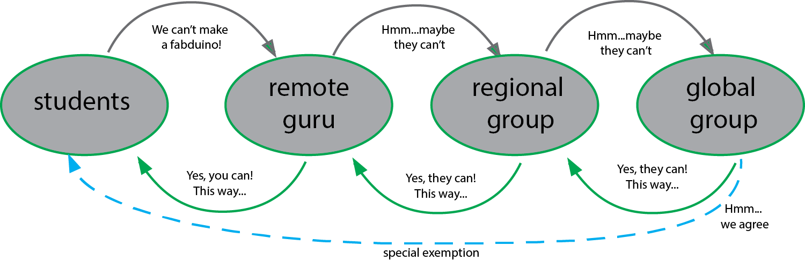

## Commercial Board Policy

Fab Academy is an experience where you can focus on developing your ideas and skills in a unique, hands-on way. Developing custom boards and building on previously Fabbed boards is part of this valuable process. Rather than using commercial boards (arduinos etc) for your final project, you will create your own personal fabduino-type board, by fabbing or modifying one of the existing designs available. If you make it early in the programme, you can troubleshoot and adjust before time becomes tight.

If you have trouble while building your own fabduino, you must speak with your remote guru about this. Please ensure that you actively seek to solve this before it affects your ability to participate in Fab Academy.

> Using commercial boards can seem simpler in the very short term, but in the medium - long term, custom boards are more flexible and effective as development tools.

## Acceptable use of Commercial Boards

### Prefabricated Arduinos
* These can be used as a extra nodes of a network that you have built, with the purpose of showing the network functionality of one of your fabricated boards. **Networking between just commercial boards is not acceptable.**

* You can use them as a base for your designed shields or connector boards.

### Single board computers: Raspberry Pi, Beaglebone etc

They are super cheap computers capable of running full operating systems, like Linux and (recently) Windows. These can be used as a substitute for your desktop/laptop.

### Commercial Board Exemption Process

If you think you have a special case where there should be raised an exemtption please talk to your local or remote guru. The case will be addressed to the Global Evaluation Team for analysis.

In any case remember that Commercial Boards are not evaluated. They are not considered as your own work, but a necessary item for your work.